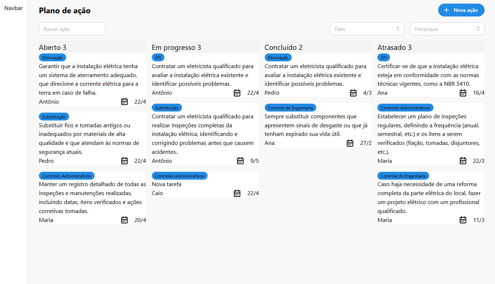

# Desafio Fullstack Haus

Protótipo de aplicação web que implementa um board para a criação e gerenciamento de um plano de ações corretivas, este projeto foi feito durante um processo seletivo para uma posição de desenvolvedor full stack.

A solução é composta de uma aplicação front end usando React JS e uma API Web feita com o ASP.NET Core.

